# VENUSPRO — Form Builder Configuration Guide

How to build a metadata-driven insurance **form** end-to-end — from basic details, sections and fields, through conditional logic, formulas, the rule/rating engine, validation and platform guardrails, to live preview, publish and versioning — with field-by-field explanations and screenshots of every flow.

> **Audience:** product/underwriting admins and form designers configuring the questionnaires a carrier uses across the policy lifecycle (Application, Quote, Endorsement, Cancellation, Claim, Renewal…).
> **Where:** the **Form Designer** and **Catalog** sections of the VENUSPRO admin (sidebar).

---

## 1. The mental model — building blocks

Everything in the platform is **metadata**. You don't code a form — you describe it, and the runtime engines render, calculate, rate and validate it live from that description. Get these blocks straight and the rest is easy.

| Block | What it is | Analogy | Where you edit it |
|---|---|---|---|
| **Carrier / Product** | The catalog a form is *written for*. A Product carries the base rate, coverages and eligible states; a Carrier owns Products. | The catalog | **Carriers**, **Products** |
| **Form** | The top-level container + its metadata (name, product, type, version, status, dates, navigation style, base premium). | A questionnaire / application | **Create Form** |
| **Section** *(+ Subsection)* | A group of fields with a layout; the unit of navigation (a wizard step / tab / accordion panel). | A page / step | **Section Builder** |
| **Field** | One captured data point, with a **type** and properties (label, API name, required, options…). | A question | **Field Builder** |
| **Rule** *(Conditional Logic)* | `IF (conditions) THEN show / hide / require / … ` a field or section. | Smart branching | **Conditional Logic** |
| **Formula** | An expression that derives a value live (for `computed` / `premium` fields). | A spreadsheet cell | **Formula Builder** (and a field's *Formula* property) |
| **Rating Rule** *(Rule / Rating engine)* | `IF (conditions) THEN` premium / eligibility / tier / referral / message. | A pricing rulebook | **Rule / Rating** |
| **Validation** | A field / section / form / cross-field check, classified **blocker / warning / info**. | A guard / assertion | **Validation Engine** |
| **Lookup Table** | Reference data (states, class codes, vehicle makes, limits) that feeds dropdowns, rating factors and validations. | A reference sheet | **Lookup Tables** |
| **Guardrail** | A **platform-wide** underwriting / rating / validation rule enforced on *every* quote & bind, on top of each form's own logic. | House rules | **Guardrails** |
| **Version** | A status- and effective-dated snapshot of the whole form definition. | A git tag | **Versioning** |
| **Submission** | The runtime artifact — the captured **answers** + the **rated result** + the **outputs** (JSON / PDF / CSV). | The filled-in application | **Preview → Review → Outputs** |

**The pipeline** (the canonical 7-step build flow shown as a stepper across the top of every builder screen):

```
Carrier → Product
     │
     ▼
 ① Create Form ──► ② Sections ──► ③ Fields ──┐
   (basic info)    (+ Workflow)   (+ Grid,    │
                                   + Lookups)  │
                                               ├─► ④ Logic ─ Conditional · Formula · Rating
   Lookup tables ──────────────────────────────┤
                                               ├─► ⑤ Validate ─ Validation Engine (+ Guardrails, platform-wide)
                                               ▼
                              ⑥ Preview  ── live runtime: show/hide, calculate, rate, validate
                                               │           (→ Review & Submit → Outputs: JSON/PDF/CSV)
                                               ▼
                              ⑦ Publish  ── snapshot + effective-dated Version
```

Auxiliary builders fold onto the step they belong to: **Workflow & Nav** → *Sections*; **Repeating Grid** and **Lookup Tables** → *Fields*; **Formula Builder** and **Rule / Rating** → *Logic*; **Review** → *Preview*; **Versioning** and **Outputs** → *Publish*.

---

## 2. The Form Designer workspace

The sidebar groups the whole surface. You'll spend most of your time in **Form Designer**, dipping into **Catalog** to pick the carrier/product and **Runtime** to test.

| Group | Screens |
|---|---|
| **Workspace** | Dashboard · **Form Library** |
| **Catalog** | **Carriers** · **Products** · **Guardrails** |
| **Form Designer** | AI Generate · Create Form · Section Builder · Field Builder · Conditional Logic · Formula Builder · Validation Engine · Repeating Grid · Lookup Tables · Rule / Rating · Workflow & Nav |
| **Runtime** | Preview (Live) · Review & Submit · Outputs |
| **Platform** | Versioning · Audit Log · API Layer · Users & Roles · Settings |

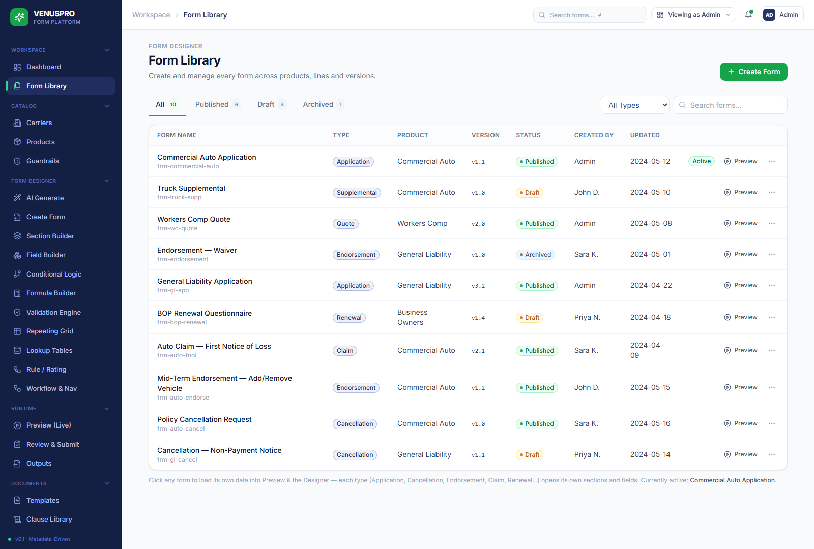

The **Form Library** lists every form with its **Type**, **Product**, **Version**, **Status** (Draft / Published / Archived) and last-updated date. The tabs (All / Published / Draft / Archived), the **Type** filter and the search box narrow the list. **Click any row's *Preview*** to load that form's own sections & fields into the Designer and Runtime — each type (Application, Cancellation, Endorsement, Claim, Renewal…) opens its own template. **Create Form** (top-right) starts a fresh one.

> ⚠️ **One active form at a time.** The Designer holds a single editable form (the "active" form). Loading another form from the Library — or generating one with AI — **replaces** what's currently in the builders. Snapshot first with **Versioning → Clone** if you want to keep it.

---

## 3. Configuration — step by step

Configure in flow order: **Catalog → Create → Sections → Fields → Logic → Validate → Preview → Publish.**

### Step 0 — Pick the Catalog (Carrier & Product)

A form is always *written for* a product. The product supplies the base rate, the coverage menu and the eligible states the rest of the form (and the guardrails) lean on.

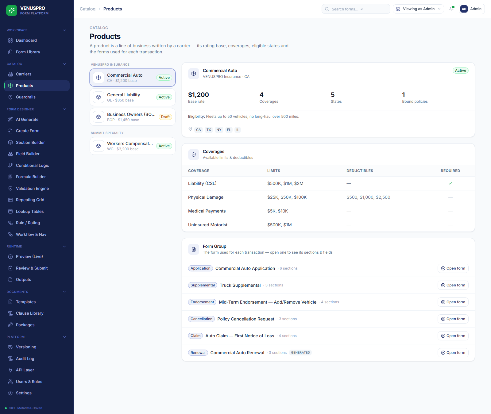

**Products** is a master–detail screen. Pick a product on the left to see its **Summary** (base rate, coverage count, states, bound policies), its **Coverages** table (limits, deductibles, required) and its **Form Group** — the form used for each transaction type, each with an **Open form** button that loads it into Preview.

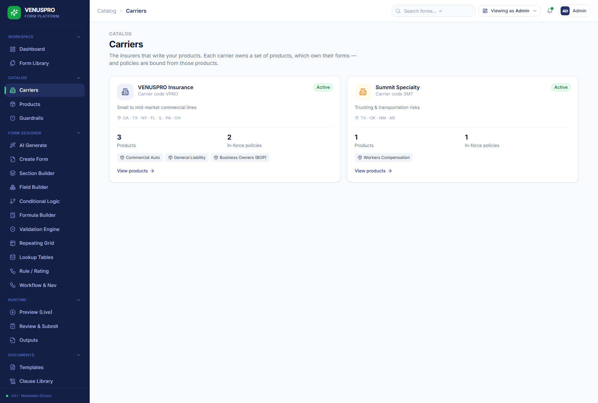

**Carriers** shows each insurer's appetite, filed states, product count and in-force policies. (Carriers and Products are read-only catalogs today — see *Gaps*.)

**Seed catalog:** Carriers — *VENUSPRO Insurance* (VPRO) and *Summit Specialty* (SMT). Products — *Commercial Auto* ($1,200 base), *General Liability* ($850), *Workers Compensation* ($3,200), *Business Owners / BOP* ($1,450, Draft).

### Step 1 — Create the form (Basic Info)

Open **Form Designer → Create Form**. This is the metadata that anchors versioning and lifecycle.

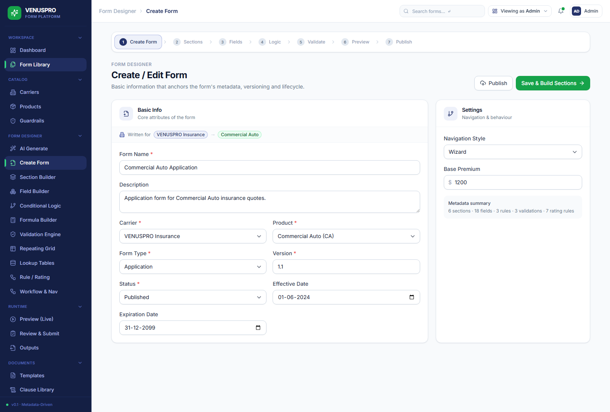

| Field | Meaning | Values |
|---|---|---|
| **Form Name** \* | Human title shown in the Library and runtime. | free text |
| **Description** | One-liner about the form's purpose. | free text |
| **Carrier** \* | The insurer the form belongs to. Changing it re-points the Product. | from the Carrier catalog |
| **Product** \* | The line of business; supplies base rate & coverages. The list is filtered to the chosen carrier. | from the Product catalog |
| **Form Type** \* | The lifecycle role of the form. | `Application` · `Supplemental` · `Quote` · `Endorsement` · `Cancellation` · `Claim` · `Renewal` |
| **Version** \* | Edition string (e.g. `1.1`). | free text |
| **Status** \* | Lifecycle state. | `Draft` · `Published` · `Archived` |
| **Effective / Expiration Date** | The window this form edition is valid for. | dates |
| **Navigation Style** | How respondents move through the form (also editable in *Workflow & Nav*). | `Wizard` · `Tabs` · `Accordion` · `Single Page` |
| **Base Premium** | The starting premium the rating engine multiplies/adds onto. | number ($) |

A **"Written for *Carrier → Product*"** banner and a live **metadata summary** (sections · fields · rules · validations · rating rules) keep you oriented. Header actions: **Publish** (flips status to Published) and **Save & Build Sections** (→ Section Builder).

#### Shortcut — draft the whole form with AI

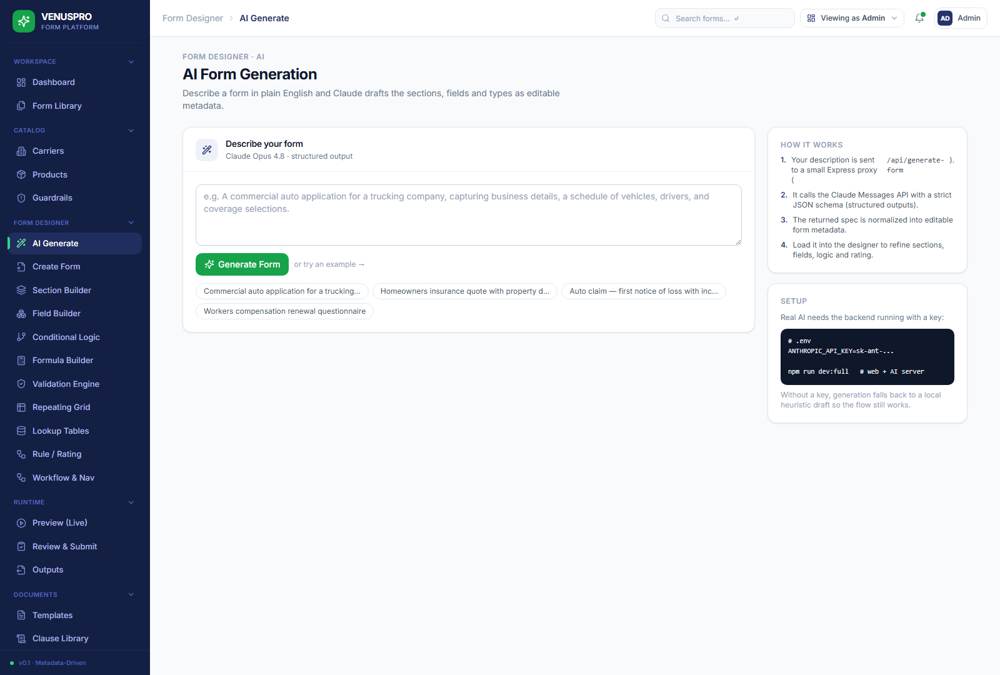

**AI Generate** turns a plain-English description into editable form metadata. Type a prompt (or pick an example), **Generate Form**, review the proposed sections/fields, then **Load into Designer** to refine. It calls a small Express proxy (`/api/generate-form`) which uses the Claude Messages API with a strict JSON schema; **without an API key it falls back to a local heuristic draft** so the flow still works. See *Developer API* for setup.

### Step 2 — Organise into Sections

Open **Form Designer → Section Builder**. Sections are the navigable chunks (wizard steps / tabs / accordion panels).

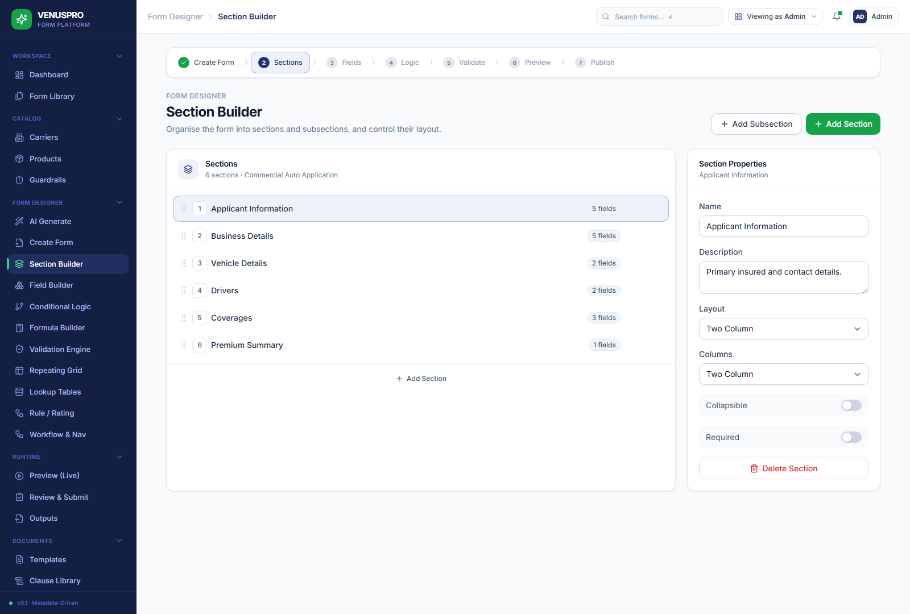

The **left tree** lists sections in order with a field count each; **drag the grip**, or use the ▲▼ buttons, to reorder; the trash icon deletes. Select a section to edit it on the right:

| Property | Meaning | Values |
|---|---|---|
| **Name** | Section heading shown in the runtime. | free text |
| **Description** | Sub-heading / instructions. | free text |
| **Layout** | How fields lay out within the section. | `Single Column` · `Two Column` · `Accordion` |
| **Columns** | Grid width for the fields. | `One Column` · `Two Column` |
| **Collapsible** | Whether the section can collapse (accordion-style). | toggle |
| **Required** | Marks the section as mandatory (governance flag). | toggle |

**Add Section** and **Add Subsection** are in the header. Subsections nest under a section for structure.

### Step 3 — Add Fields

Open **Form Designer → Field Builder**. Pick the section to edit (top dropdown), click a type in the palette to append it, then edit its properties.

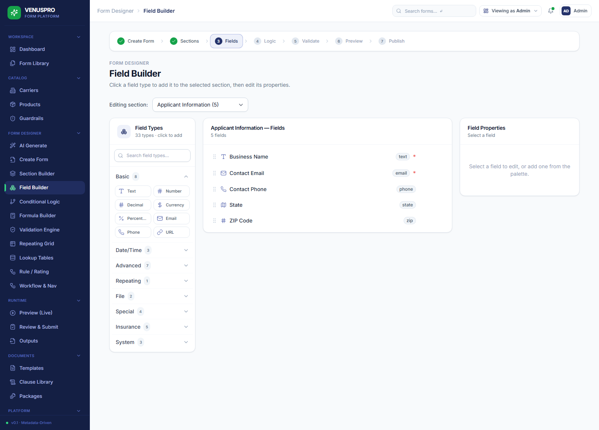

**Left — the palette.** **33 field types** in 8 searchable, collapsible groups. Click a type to add it to the selected section.

| Group | Types |
|---|---|
| **Basic** (8) | Text · Number · Decimal · Currency · Percentage · Email · Phone · URL |
| **Date/Time** (3) | Date · Date & Time · Time |
| **Advanced** (7) | Address · State · Country · Zip Code · Dropdown · Radio · Checkbox |
| **Repeating** (1) | Grid / Table |
| **File** (2) | File Upload · Image Upload |
| **Special** (4) | Signature · Rich Text · Label · Divider |
| **Insurance** (5) | Limit · Deductible · Coverage Selector · Class Code · Premium |
| **System** (3) | Hidden Field · System Field · Computed Field |

**Centre — fields in the section.** Reorder by drag or ▲▼; delete with the trash icon; click a field to edit it.

**Right — Field Properties** (for the selected field):

| Property | Meaning | Applies to |
|---|---|---|
| **Label** | The question text shown to the user. | all |
| **API Name** | The machine key answers are stored under, and what formulas/conditions reference. *(spaces stripped)* | all |
| **Help Text** | A hint shown under the field. | all |
| **Placeholder** | Ghost text inside the input. | all |
| **Column Span** | `1` or `2` — how wide the field is in a two-column section. | all |
| **Prefix** | Unit decoration, e.g. `$` or `%`. | all |
| **Formula** | The expression that computes the value (see Formula reference). | `computed`, `premium` |
| **Options** | The label→value choices (add/edit/remove rows). | `select`, `radio`, `coverage`, `checkbox` |
| **Required** | Field must be answered (gates submit as a blocker). | toggle |
| **Read-only** | Display-only (e.g. a computed premium). | toggle |

> **Naming matters.** Conditions, formulas, validations and rating rules all reference fields by **API Name**. Keep them stable and meaningful (`vehicleCount`, `annualRevenue`) — renaming an API name silently breaks any rule that points at the old one.

### Step 4 — Logic

Three engines share the same condition model and run **live** in Preview.

#### 4a. Conditional Logic — show / hide / require by answer

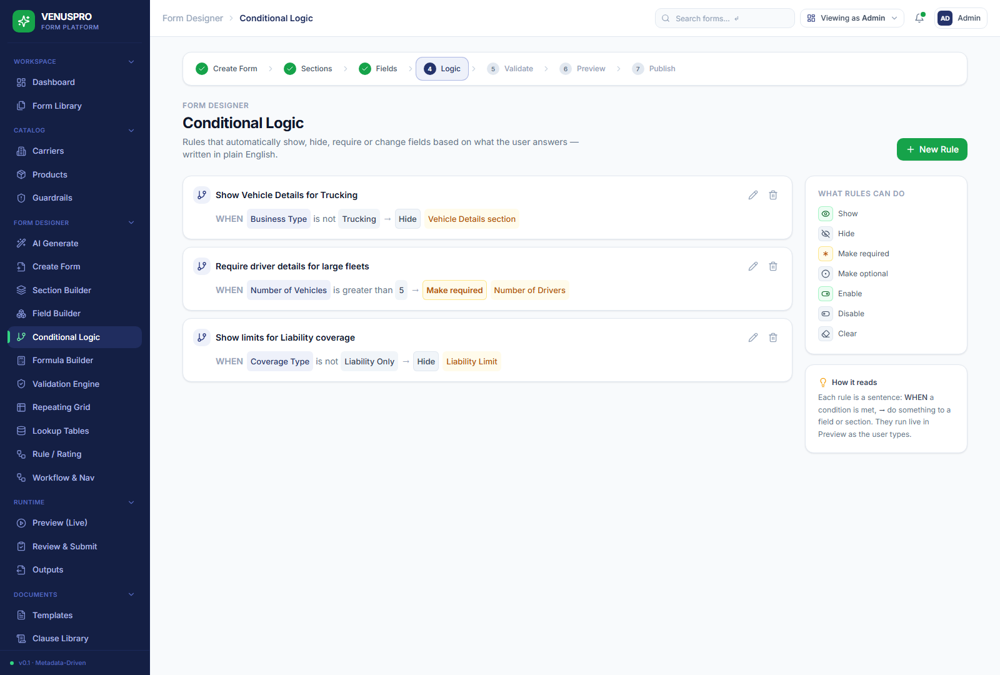

Each rule reads as a sentence: **WHEN** *conditions* **→** *action* on *targets*. Click **New Rule**:

| Field | Meaning |
|---|---|
| **Rule name** | A label, e.g. *"Show vehicles for trucking"*. |
| **WHEN** | The condition group (the shared condition editor — see Reference 4.2). Combine conditions with **AND / OR / NOT**. |
| **THEN do this** | The action: **Show**, **Hide**, **Make required**, **Make optional**, **Enable**, **Disable**, **Clear**. |
| **to these fields / sections** | The targets — check any sections and/or fields the action applies to. |
| **Preview** | A live plain-English read-back of the rule. |

Seeded examples: *Show Vehicle Details for Trucking*, *Require driver details for large fleets* (`vehicleCount > 5`), *Show limits for Liability coverage*.

#### 4b. Formula Builder — derive values live

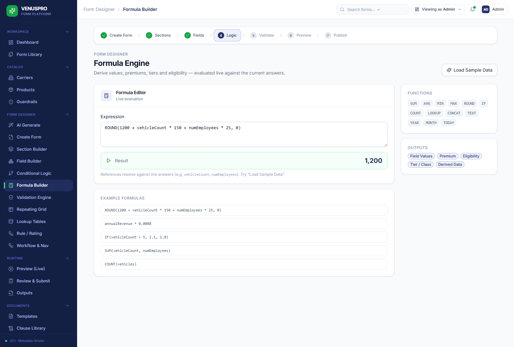

A live sandbox: type an **expression**, see the **result** computed against the current answers. References resolve by **API Name** (`vehicleCount`, `numEmployees`). Click a **Function** chip to insert it, or an **Example** to load it. Use these expressions in a field's **Formula** property (for `computed`/`premium` fields) or in `expression`-type validations.

Example: `ROUND(1200 + vehicleCount * 150 + numEmployees * 25, 0)`. Full function list in Reference 4.3.

#### 4c. Rule / Rating Engine — price, qualify, route

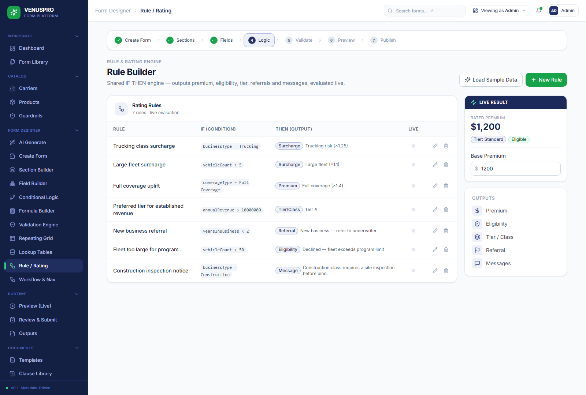

The shared IF-THEN engine that turns answers into a **rated result**. It starts from the form's **Base Premium** and applies each firing rule top-down; the right panel shows the **live result** (premium, tier, eligibility) and updates as you type. Click **New Rule**:

| Field | Meaning | Values |
|---|---|---|
| **Rule Name** | A label, e.g. *"Large fleet surcharge"*. | free text |
| **IF — Conditions** | The condition group (same editor as Conditional Logic). | — |
| **Output** | What the rule produces. | `Premium` · `Surcharge` · `Tier/Class` · `Eligibility` · `Referral` · `Message` |
| **Result** | The human-readable outcome, e.g. `Tier B`, `Decline`, a message. | free text |
| **Effect** *(Premium/Surcharge only)* | How it changes premium. | `Multiplier (×)` · `Flat (+)` |
| **Amount** *(Premium/Surcharge only)* | The multiplier or flat amount. | number |

Seeded rules include a *Trucking class surcharge* (×1.25), *Large fleet surcharge* (×1.1), a *Preferred tier* for high revenue, a *new-business referral*, and a *fleet-too-large* decline. The **Base Premium** is editable here too. See Reference 4.4 for exactly how each output behaves.

### Step 5 — Validate

#### 5a. Validation Engine — per-form checks

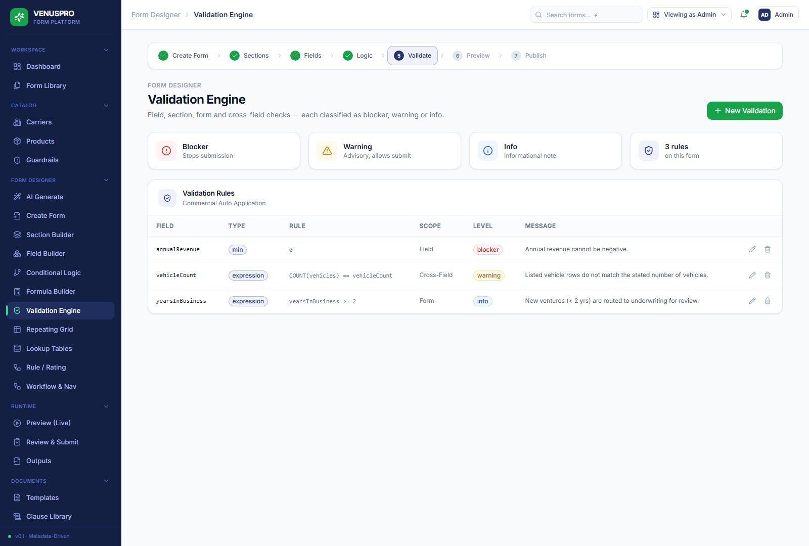

Each validation is one check. Click **New Validation**:

| Field | Meaning | Values |
|---|---|---|
| **Field** | The field (API name) the check applies to. | from the form's fields |
| **Type** | The kind of check. | `required` · `min` · `max` · `minLength` · `maxLength` · `regex` · `expression` |
| **Value / Expression** | The threshold, pattern, or (for `expression`) a formula that must be **true** to pass. | depends on type |
| **Level** | Severity. **Blocker** stops submit; **Warning** and **Info** are advisory. | `Blocker` · `Warning` · `Info` |
| **Scope** | Where it applies (labelling/grouping). | `Field` · `Section` · `Form` · `Cross-Field` |
| **Message** | The text shown when it fails. | free text |

> A field marked **Required** in the Field Builder already produces a blocker automatically — you only add a `required` *validation* for cross-field cases. `expression` validations are the cross-field workhorse, e.g. `COUNT(vehicles) == vehicleCount`. Only **blockers** gate submission; warnings/info let the user proceed.

#### 5b. Guardrails — platform-wide governance

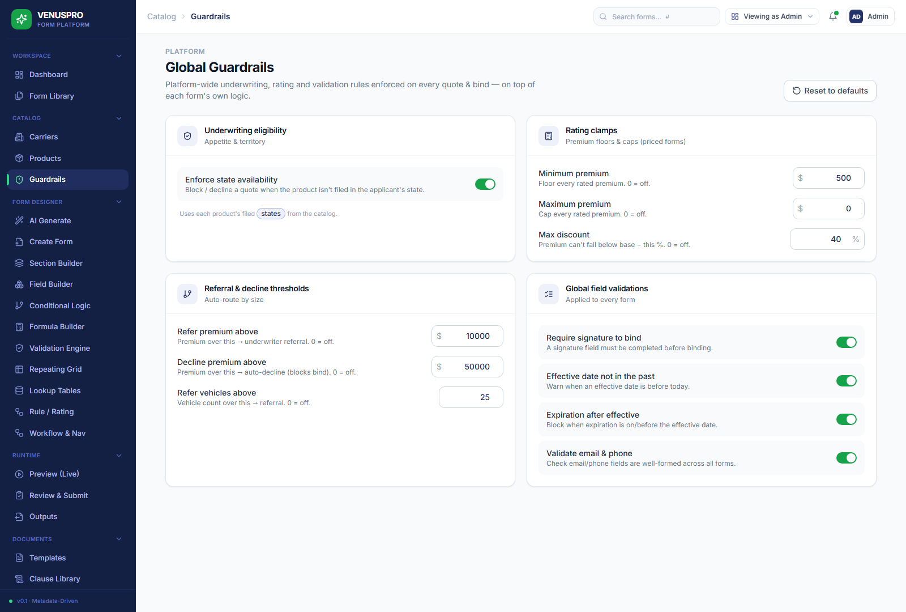

**Guardrails** (under *Catalog*) sit **on top of every form**, regardless of that form's own rules. They're configured once across four cards. Each finding is **block / refer / warn**, and the overall **decision** is `Eligible → Referral → Declined` (it can only escalate). A quote is **clear to bind** only when not Declined and no `block` finding exists.

| Card | Setting | Default | Effect |
|---|---|---|---|
| **Underwriting eligibility** | Enforce state availability | on | Decline when the product isn't filed in the applicant's state. |
| **Rating clamps** *(priced forms)* | Minimum premium | $500 | Floor every rated premium (`0` = off). |
| | Maximum premium | off | Cap every premium (`0` = off). |
| | Max discount | 40% | Premium can't fall below base − this %. |
| **Referral & decline thresholds** | Refer premium above | $10,000 | Over this → underwriter referral. |
| | Decline premium above | $50,000 | Over this → auto-decline (blocks bind). |
| | Refer vehicles above | 25 | Vehicle count over this → referral. |
| **Global field validations** | Require signature to bind | on | A signature field must be completed before bind. |
| | Effective date not in the past | on | Warn when effective date is before today. |
| | Expiration after effective | on | Block when expiration ≤ effective. |
| | Validate email & phone | on | Check email/phone fields are well-formed across all forms. |

**Reset to defaults** restores the table above. Full evaluation order is in Reference 4.6.

### Supporting builders

**Lookup Tables** — editable reference data that powers dropdowns, rating factors and validations.

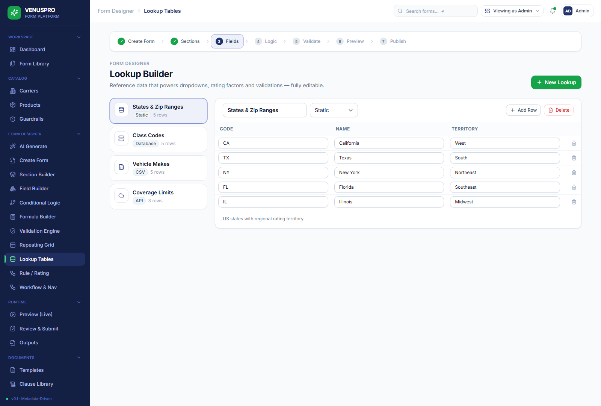

Pick a table on the left; edit its **Name**, **Source** (`Static` / `CSV` / `Database` / `API`), columns and rows on the right (cells are inline-editable; **Add Row** / delete per row). Seeded tables: *States & Zip Ranges*, *Class Codes*, *Vehicle Makes*, *Coverage Limits*. Reference a table from a formula with `LOOKUP(tableId, key, column)`.

**Repeating Grid** — capture collections (vehicles, drivers, locations) as editable tables.

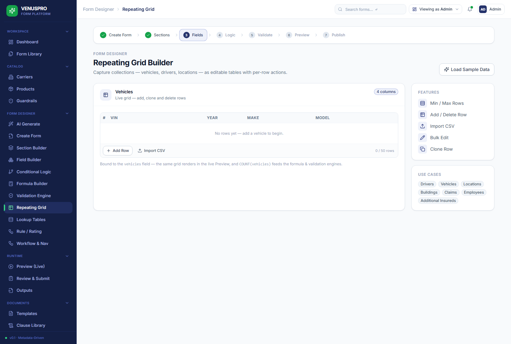

This screen renders the first **Grid / Table** field in the form (add one from the Field Builder). Each grid has **columns** (with per-column type — text/number/select), **min/max rows**, and per-row **Add / Clone / Delete**. The row count feeds the engines via `COUNT(apiName)` — e.g. validate that listed vehicles match a stated count.

**Workflow & Nav** — choose how respondents move through the form.

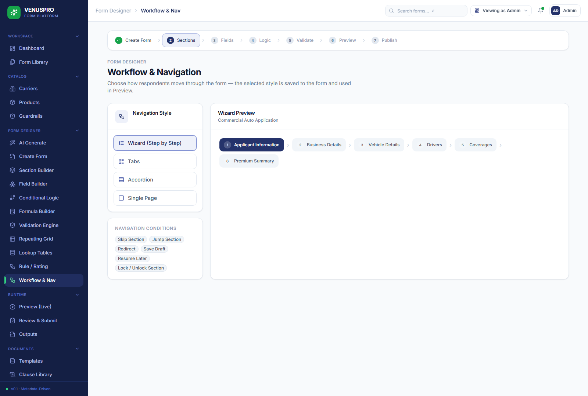

Pick a **Navigation Style** — **Wizard (Step by Step)**, **Tabs**, **Accordion**, or **Single Page** — saved to the form and used in Preview; the right panel previews it. (The *Navigation Conditions* chips — Skip / Jump / Redirect / Save Draft / Resume Later / Lock-Unlock Section — are roadmap labels, not yet configurable.)

### Step 6 — Preview against live data

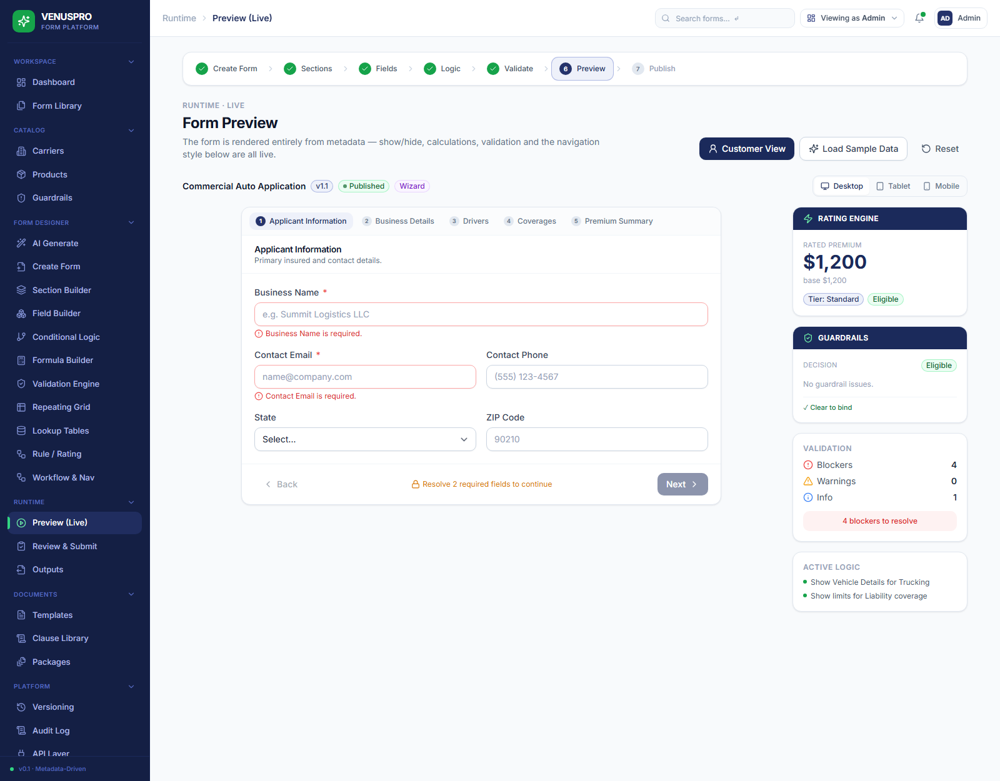

**Preview (Live)** renders the form *entirely from metadata* in the chosen navigation style, with a **device** toggle (Desktop / Tablet / Mobile). **Load Sample Data** fills realistic answers; **Reset** clears them; **Customer View** opens the applicant-facing flow. The right **engine panel** is live:

- **Rating Engine** — rated premium (vs base), tier, eligibility, surcharges, referrals, messages.
- **Guardrails** — the decision, any premium clamp, findings, and the **Clear to bind / Bind blocked** status.
- **Validation** — blocker / warning / info counts and a *Ready to submit* pill.
- **Active Logic** — which conditional rules are currently firing.

> This is where everything comes together: show/hide rules, formulas, the rating engine, validation and guardrails all run as you type. *Notice in the screenshot that the seeded "Vehicle Details" section is hidden because the conditional rule keys off `businessType == Trucking` — that's branching working live.*

#### Review & Submit

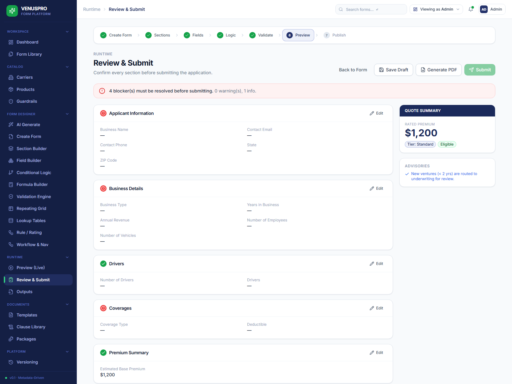

A read-back of every visible section with a **Quote Summary** (premium, tier, eligibility) and **Advisories** (warnings/info). **Submit** is disabled until all blockers clear; submitting shows a confirmation modal with **Download JSON**. **Generate PDF** exports the field-mapped document.

### Step 7 — Publish, Version & Export

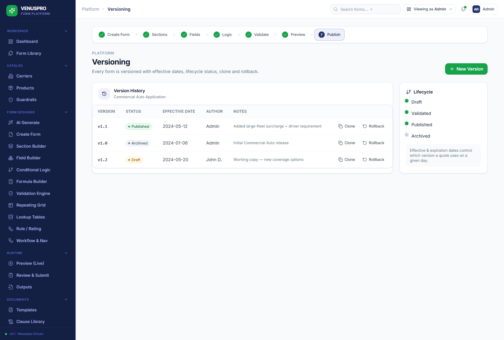

**Versioning** lists the form's editions (Version, Status, Effective Date, Author, Notes, actions). **New Version** / **Clone** capture a full **snapshot** of the current form definition as a new Draft (marked *Restorable*); **Rollback** restores a snapshot and re-points the published edition. The lifecycle stepper reads **Draft → Validated → Published → Archived**; effective & expiration dates decide which version a quote uses on a given day.

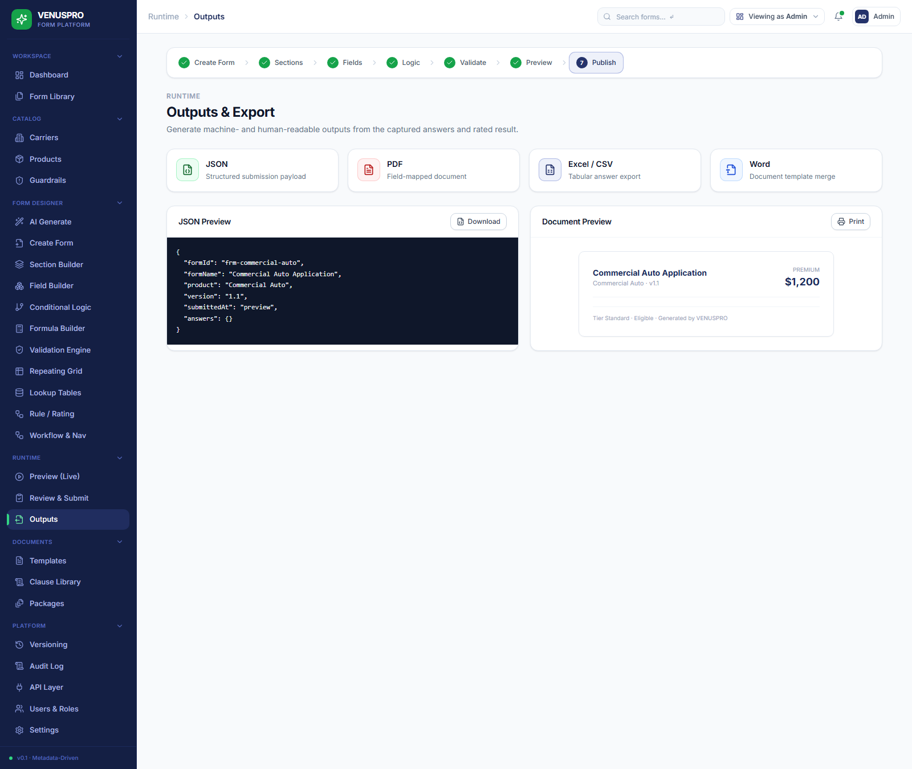

**Outputs** generates machine- and human-readable artifacts from the captured answers + rated result: **JSON** (the submission payload), **PDF** (field-mapped document), **Excel / CSV** (tabular), and **Word** (print/merge), with live JSON and document previews.

---

## 4. Reference

### 4.1 Field-type catalog (33 types)

| Group | Type · *(label)* |
|---|---|
| **Basic** | `text` Text · `number` Number · `decimal` Decimal · `currency` Currency · `percentage` Percentage · `email` Email · `phone` Phone · `url` URL |
| **Date/Time** | `date` Date · `datetime` Date & Time · `time` Time |
| **Advanced** | `address` Address · `state` State · `country` Country · `zip` Zip Code · `select` Dropdown · `radio` Radio · `checkbox` Checkbox |
| **Repeating** | `grid` Grid / Table |
| **File** | `file` File Upload · `image` Image Upload |
| **Special** | `signature` Signature · `richtext` Rich Text · `label` Label · `divider` Divider |
| **Insurance** | `limit` Limit · `deductible` Deductible · `coverage` Coverage Selector · `classcode` Class Code · `premium` Premium |
| **System** | `hidden` Hidden Field · `system` System Field · `computed` Computed Field |

Money types (`currency`, `limit`, `deductible`, `premium`) default a `$` prefix; `percentage` defaults `%`; `computed`/`premium` carry a **Formula**; `select`/`radio`/`coverage`/`checkbox` carry **Options**.

### 4.2 Condition operators (the WHEN / IF editor)

Used identically by Conditional Logic and the Rule/Rating engine. A condition is `field OPERATOR value`; group them with **AND** (all), **OR** (any) or **NOT** (none), and nest groups.

| Operator | Reads as | Compares |
|---|---|---|
| `equals` | is | string equality |
| `notEquals` | is not | string inequality |
| `greaterThan` | is greater than | numeric |
| `lessThan` | is less than | numeric |
| `greaterOrEqual` | is at least | numeric |
| `lessOrEqual` | is at most | numeric |
| `contains` | contains | case-insensitive substring |
| `isEmpty` | is empty | no value / empty array |
| `isNotEmpty` | is not empty | has a value |

An **empty** condition group evaluates **true** (the rule always fires). A reference to a grid field yields its **row count**.

### 4.3 Formula functions & syntax

A safe expression evaluator (no `eval`). Bare identifiers resolve against live answers by **API Name** (missing → `0`; arrays → length). Operators: `+ - * /`, comparisons `> < >= <= == !=`, parentheses, string literals, `TRUE`/`FALSE`. `+` concatenates when either side is non-numeric.

| Function | Does |
|---|---|
| `SUM(…)` / `AVG(…)` / `MIN(…)` / `MAX(…)` | Aggregate numeric args. |
| `ROUND(x, d?)` | Round `x` to `d` decimals (default 0). |
| `IF(cond, a, b)` | `a` if `cond` truthy, else `b`. |
| `COUNT(ref)` | Array length, or count of non-empty args. |
| `LOOKUP(tableId, key, column)` | First row whose any value equals `key` → its `column`. |
| `CONCAT(…)` | Join args as text. |
| `TEXT(x)` | Stringify. |
| `YEAR(x)` / `MONTH(x)` | Pull year/month from an ISO date string. |
| `TODAY()` | Today *(currently a stub — returns empty)*. |

Examples: `ROUND(1200 + vehicleCount * 150 + numEmployees * 25, 0)` · `annualRevenue * 0.0008` · `IF(vehicleCount > 5, 1.1, 1.0)` · `COUNT(vehicles)`.

### 4.4 Rating outputs & effects

`rate()` starts at the form's **Base Premium** and applies each firing rule top-down; the final premium is rounded.

| Output | Behaviour |
|---|---|
| **Premium** / **Surcharge** | `multiplier` → `premium ×= amount`; `flat` → `premium += amount`. Listed as a surcharge. |
| **Tier/Class** | Sets the result **tier** (last firing rule wins). |
| **Eligibility** | If the result text matches *declin*… → **Declined**; *refer*… → **Referral**. |
| **Referral** | Adds a referral note; promotes eligibility to **Referral** if still Eligible. |
| **Message** | Adds an advisory message. |

Result shape: `{ basePremium, premium, tier (default "Standard"), eligibility (Eligible/Referral/Declined), surcharges[], referrals[], messages[] }`.

### 4.5 Validation types & levels

| Type | Fails when |
|---|---|
| `required` | value is empty |
| `min` / `max` | numeric value below / above the threshold |
| `minLength` / `maxLength` | text length below / above the threshold |
| `regex` | value doesn't match the pattern |
| `expression` | the formula doesn't evaluate truthy (cross-field) |

Levels: **blocker** (stops submit) · **warning** · **info** (both advisory). Required fields auto-emit a blocker; only blockers gate `canSubmit`.

### 4.6 Guardrail evaluation order

1. **State availability** — product not filed in the answered `state` → **block** (Declined).
2. **Rating clamps** (priced forms): max-discount floor → minimum-premium floor → maximum-premium cap (each a **warn** when it adjusts).
3. **Referral / decline thresholds** vs the adjusted premium → **block** (decline) or **refer**; vehicle-count threshold → **refer**.
4. **Email / phone** well-formedness (email fail = **block**, phone fail = **warn**).
5. **Dates** — effective-in-past = **warn**; expiration ≤ effective = **block**.
6. **Signature** required-to-bind and missing → **block**.
7. **canBind** = decision ≠ Declined *and* no `block` finding.

### 4.7 Statuses & navigation styles

| Form status | Meaning |
|---|---|
| **Draft** | Editable; not live. |
| **Published** | Live edition. |
| **Archived** | Retired; kept for history. |

**Navigation styles:** `Wizard` (stepper, one section at a time, gated *Next*), `Tabs` (free tab switching, per-tab blocker counts), `Accordion` (collapsible panels), `Single Page` (everything open).

---

## 5. Worked example — a Commercial Auto Application

Goal: a Commercial Auto application that captures the business, a schedule of vehicles & drivers, and coverages — prices itself, shows trucking-only sections, and won't bind oversized fleets.

1. **Catalog** — in **Products**, confirm *Commercial Auto* ($1,200 base, states CA/TX/NY/FL/IL, Liability/Physical Damage/Medical/UM coverages).
2. **Create Form** — Name *"Commercial Auto Application"*; Carrier *VENUSPRO Insurance*; Product *Commercial Auto*; Type **Application**; Navigation **Wizard**; Base Premium **1200**.
3. **Sections** — Applicant Information · Business Details · Vehicle Details · Drivers · Coverages · Premium Summary (6 sections).
4. **Fields** — add `businessType` (Dropdown incl. *Trucking*), `vehicleCount` (Number), a `vehicles` **Grid**, `annualRevenue` (Currency), a `coverageType` (Coverage Selector), `liabilityLimit` (Limit), and a read-only **Premium** field with formula `ROUND(1200 + vehicleCount * 150 + numEmployees * 25, 0)`.
5. **Logic** —
   - *Conditional:* `WHEN businessType is not "Trucking" → Hide` the Vehicle Details section; `WHEN vehicleCount is greater than 5 → Make required` the driver fields.
   - *Rating:* `businessType == Trucking → Surcharge ×1.25`; `vehicleCount > 5 → Surcharge ×1.1`; `vehicleCount > 50 → Eligibility "Declined — fleet exceeds program limit"`.
6. **Validate** — `annualRevenue min 0` (blocker); cross-field `expression: COUNT(vehicles) == vehicleCount` (warning).
7. **Guardrails** — leave state-availability **on** (so non-CA/TX/NY/FL/IL declines), minimum premium $500, decline above $50,000.
8. **Preview** — *Load Sample Data*; confirm the premium rates live, the Vehicle Details section appears only for Trucking, and the engine panel reports **Clear to bind**.
9. **Publish & Version** — set Status **Published**; in **Versioning**, *Clone* to snapshot v1.1.

> The seed form ships exactly this way: open **Form Library → Commercial Auto Application → Preview**. Because `businessType` starts empty (≠ Trucking), the **Vehicle Details** section is hidden — the wizard shows 5 of 6 sections until you pick Trucking.

---

## 6. Developer API

The **API Layer** page documents the form contract (mocked on the bundled Express server):

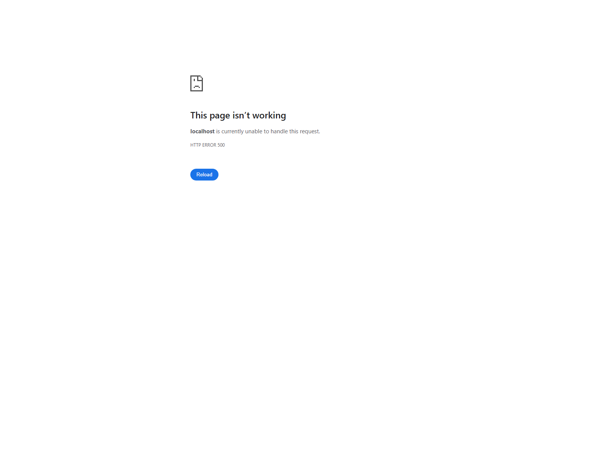

`GET /form/{id}` · `POST /form/{id}/save` (draft answers) · `POST /form/{id}/submit` · `POST /form/{id}/validate` · `POST /form/{id}/calculate` (premium) · `GET /rules` · `POST /files/upload` · `POST /documents/pdf` · `GET /lookups/{table}` · `GET /form/{id}/versions`.

The live backend (`npm run server`, port 8787; Vite proxies `/api`) currently implements **AI generation**:

- `POST /api/generate-form` `{ prompt }` → a structured form spec via the Claude Messages API (model `claude-opus-4-8`, JSON-schema structured output).
- `GET /api/health` → `{ ok, ai }`.

```bash
# .env
ANTHROPIC_API_KEY=sk-ant-...

npm run dev:full   # web + AI server
```

Without a key, **AI Generate** falls back to a local heuristic draft.

---

## 7. What's **not** yet configurable (gaps & roadmap)

Honest list, roughly by priority.

**P1 — multi-form & lifecycle**
1. **One active form at a time.** The Designer edits a single in-memory form; loading another from the Library (or AI-generating) **replaces** it. There's no side-by-side editing or per-form isolation — snapshot via *Versioning → Clone* before switching.
2. **No payment step.** The runtime is **Preview → Review → Submit** (a confirmation modal) and **Publish** is a *status* action — there is **no checkout/billing/payment** screen anywhere. (Listed because it's commonly expected alongside "preview / publish".)
3. **`setValue` action isn't in the UI.** The conditional-logic engine supports a *Set value* action, but the rule editor only exposes Show/Hide/Require/Optional/Enable/Disable/Clear.

**P2 — builder depth**
4. **Subsections are structural only** — you can add them, but the Field Builder edits fields at the section level (no dedicated subsection field palette).
5. **Workflow "Navigation Conditions"** (Skip / Jump / Redirect / Save Draft / Resume Later / Lock-Unlock) are display-only labels, not yet wired.
6. **Grid "Import CSV"** currently just adds a blank row (stub); **`TODAY()`** in formulas returns empty (stub).

**P3 — catalog & data**
7. **Carriers & Products are read-only** in the UI (seeded catalog; no add/edit screen).
8. **Lookup sources** (`CSV` / `Database` / `API`) are labels — rows are edited inline; there's no live fetch/sync.
9. **Guardrails key off conventional field names** (`state`, `vehicleCount`, and email/phone/effective/expiration by type or name pattern) rather than an explicit mapping per form.

**P4 — production-readiness**
10. **Persistence is browser localStorage** (demo) — production needs server storage and a real submit/rate/validate API behind the documented contract.
11. **Rating is a single top-down pass** — no rating tables beyond lookups, no taxes/fees/installments.
12. **Roles aren't enforced** — the persona switcher and Users & Roles page are presentational.

---

## 8. Cheat sheet

| I want to… | Go to… |
|---|---|
| Start a new form / set product & type | **Create Form** |
| Draft a form from a description | **AI Generate** → *Load into Designer* |
| Organise the form into steps | **Section Builder** |
| Add or edit a question | **Field Builder** → pick a type → edit properties |
| Show/hide/require a field by answer | **Conditional Logic** |
| Compute a value live | **Formula Builder** (or a field's *Formula* property) |
| Price the form / set eligibility & tiers | **Rule / Rating** |
| Add a data check | **Validation Engine** |
| Enforce a rule across every form | **Guardrails** |
| Manage reference data (states, class codes…) | **Lookup Tables** |
| Capture a collection (vehicles, drivers) | **Field Builder** → add a *Grid* field → **Repeating Grid** |
| Choose Wizard / Tabs / Accordion / Single Page | **Workflow & Nav** (or *Create Form → Navigation Style*) |
| Test it live (with the engines running) | **Preview (Live)** |
| Review everything before submit | **Review & Submit** |
| Export JSON / PDF / CSV / Word | **Outputs** |
| Snapshot or roll back the form | **Versioning** |
| See which carrier/product a form is for | **Carriers** / **Products** |

*Generated for VENUSPRO — Form Builder.*
