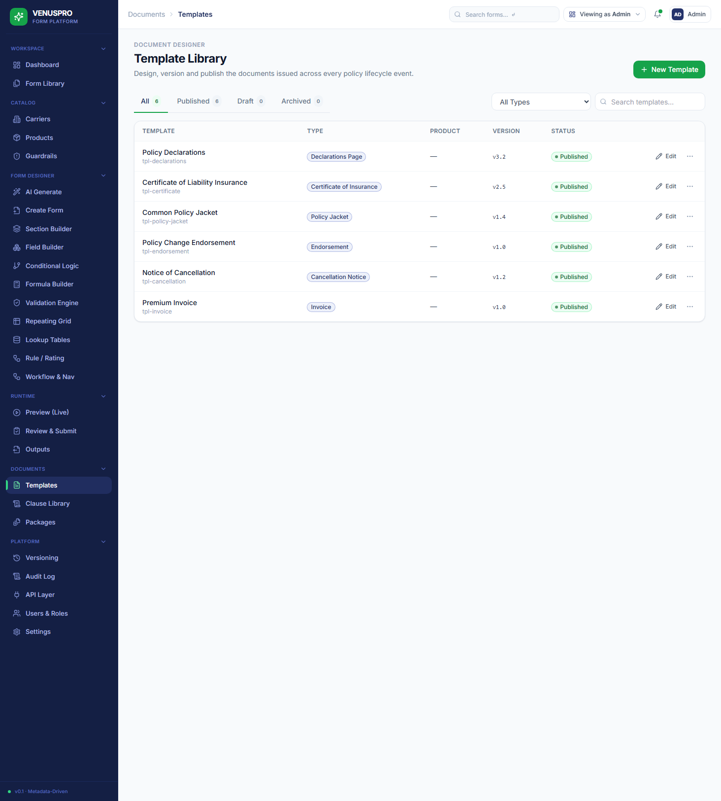
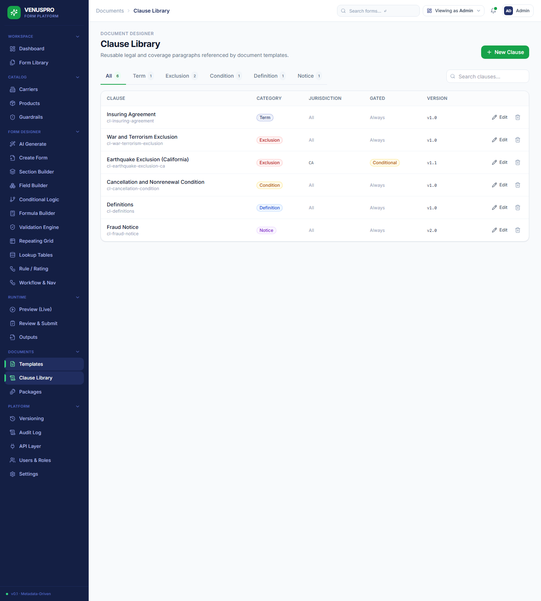
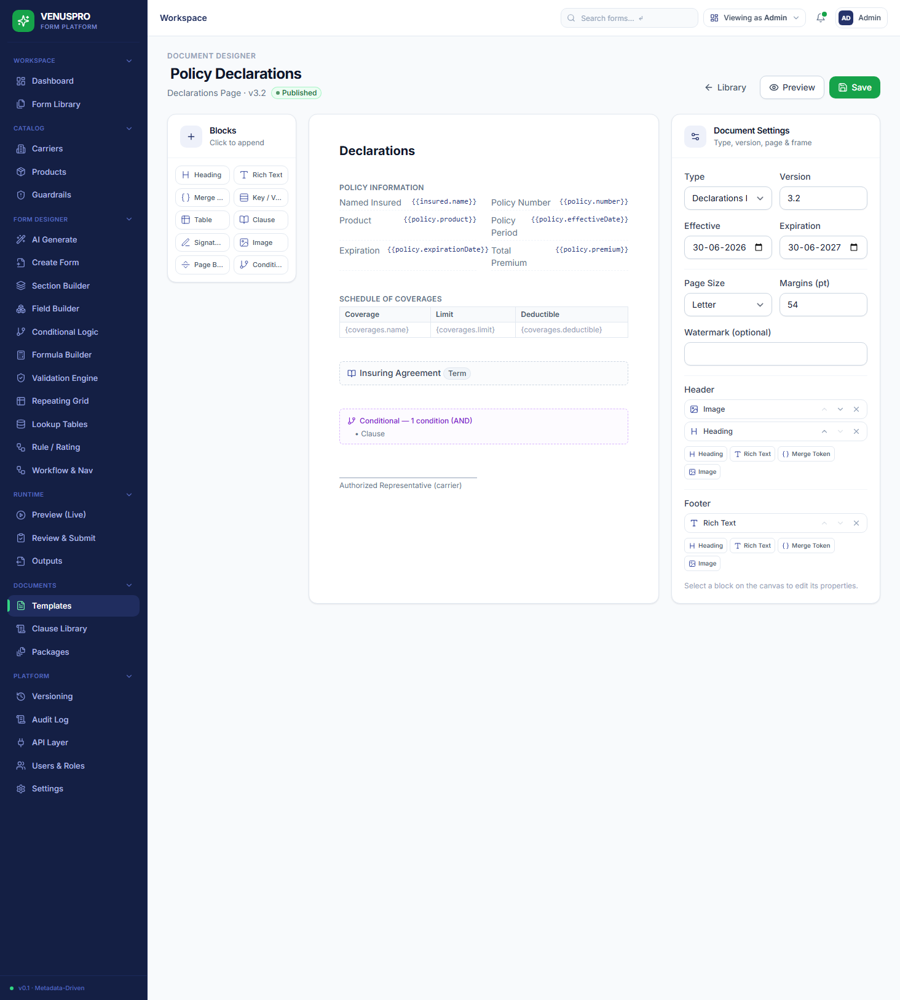
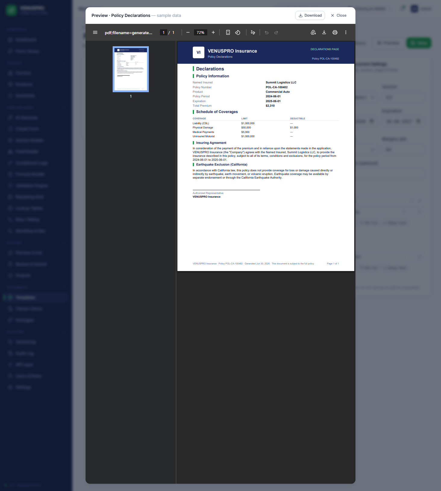
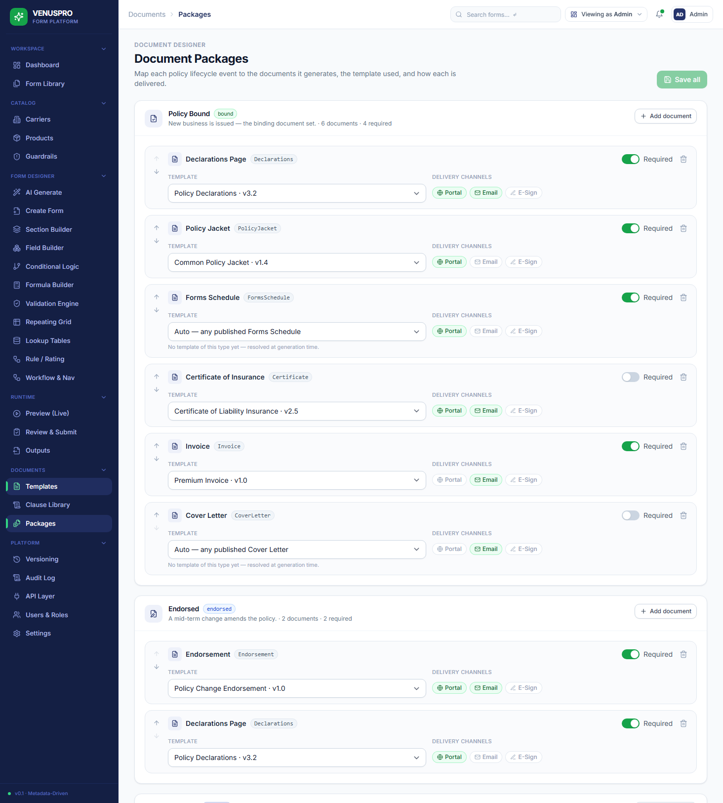
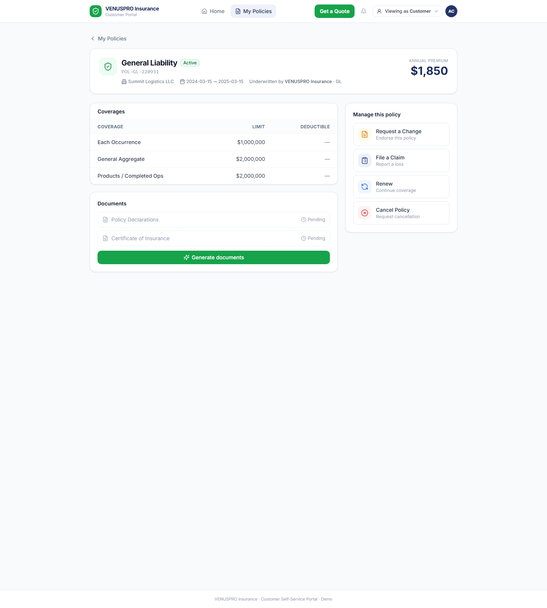
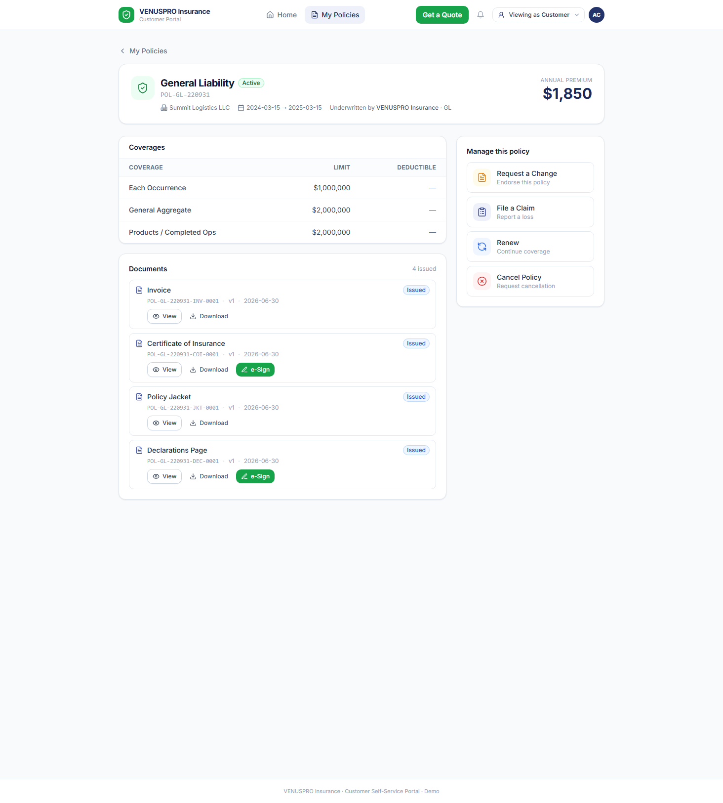
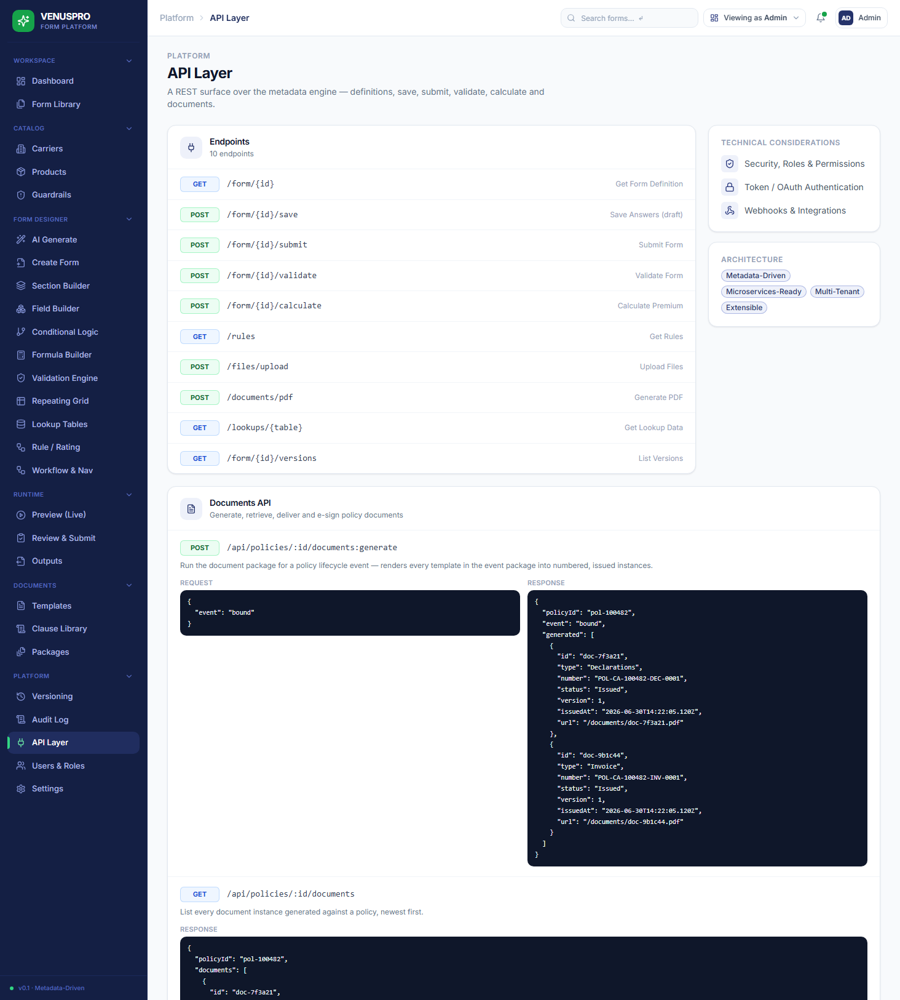

# VENUSPRO — Document Module Configuration Guide

How to configure policy documents (Declarations, Certificates, Jackets, Endorsements, Cancellation notices, Invoices…) for your insurance **products** and **policies** — with field-by-field explanations and screenshots of every flow.

> **Audience:** product/underwriting admins configuring the document set a carrier issues across the policy lifecycle.
> **Where:** the **Documents** section of the VENUSPRO admin (sidebar → *Documents*).

---

## 1. The mental model — four building blocks

Everything in the module is one of four things. Get these straight and the rest is easy.

| Block | What it is | Analogy | Where you edit it |
|---|---|---|---|
| **Clause** | A reusable paragraph of legal/coverage wording (insuring agreement, an exclusion, a condition, a notice). Can carry merge tokens and a condition for when it applies. | A snippet / "smart text" | **Clause Library** |
| **Template** | The *design* of one document — an ordered list of content **blocks** + page setup. Produces a specific document type (Declarations, COI…). | A mail-merge letterhead | **Template Library → Document Builder** |
| **Package** | A mapping that says *"when this lifecycle event happens, generate these document types, using these templates, deliver via these channels."* | A rulebook | **Document Packages** |
| **Instance** | A generated, **numbered, frozen** PDF for a real policy (e.g. `POL-CA-100482-DEC-0001`). Created automatically when an event fires. | The printed/issued document | Customer **portal** (read-only) |

**The pipeline:**

```
Clauses ─┐
         ├─►  Template (blocks + tokens + conditions)  ─┐
Tokens ──┘                                              │
                                                        ├─► Package (event → templates → channels)
Policy lifecycle event (bind / endorse / cancel / …) ───┘
                                                        │
                                                        ▼
                                          Instance(s)  = numbered PDF, persisted,
                                          delivered to the portal & marked Issued
```

---

## 2. The Documents workspace

The sidebar **Documents** group has three screens. That's the whole configuration surface.

| Screen | Purpose |
|---|---|
| **Templates** | Library of all document designs; create / edit / version / publish. |
| **Clause Library** | Reusable wording referenced by templates. |
| **Packages** | Which documents fire on each lifecycle event, and how they're delivered. |



The library lists every template with its **Type**, **Product**, **Version**, and **Status** (Draft / Published / Archived). Only **Published** templates are used by the generator. The tabs (All / Published / Draft / Archived) and the type filter narrow the list.

---

## 3. Configuration — step by step

Configure in this order: **Clauses → Templates → Packages → Preview → Publish → Verify**.

### Step 1 — Author reusable Clauses

Open **Documents → Clause Library**. Clauses are the legal "lego bricks" you drop into multiple templates, so you write each one once.



**Clause fields:**

| Field | Meaning | Example |
|---|---|---|
| **Name** | Human label shown in pickers. | `Earthquake Exclusion (California)` |
| **Category** | Groups the clause: **Term**, **Exclusion**, **Condition**, **Definition**, **Notice**. Drives the filter tabs. | `Exclusion` |
| **Jurisdiction** | State codes the clause is written for (tags). Blank = applies anywhere. | `CA` |
| **Version** | Edition string; issued documents pin the version they used. | `v1.1` |
| **Body (HTML)** | The wording. Insert merge tokens with the **`{{ }}` token picker** (e.g. `{{insured.name}}`). | *"In accordance with California law…"* |
| **Gated / When** | Optional condition (the **Conditional** toggle + condition editor). When set, the clause is **only** included if the condition is true at generation time. Shows as **Conditional** in the *Gated* column; otherwise **Always**. | include only when `state == CA` |

> A clause with a **When** condition is the cleanest way to make one template behave differently per state or per product — the renderer evaluates the condition against the policy/answers and drops the clause in or out automatically.

### Step 2 — Design the Template (Document Builder)

From **Templates**, click **New Template** (or **Edit** an existing one) to open the **Document Builder** — a three-pane editor.



**Left — Block palette.** Click to append a block; drag the rows to reorder. The block kinds:

| Block (palette) | `kind` | Use it for |
|---|---|---|
| **Heading** | `heading` | Document title / section headers (levels 1–3). |
| **Text** | `richtext` | Free paragraphs — terms & conditions, instructions. Supports `{{tokens}}`. |
| **Merge** | `merge` | A single inline merged value, e.g. the policy number. |
| **Key/Val** | `keyValue` | The label→value rows of a Declarations page (Named Insured, Policy Period, Premium…). |
| **Table** | `table` | A data table bound to a source: **coverages**, **forms**, **vehicles**, or custom. |
| **Clause** | `clauseRef` | Insert a clause from the library (honours that clause's own *When*). |
| **Sign** | `signature` | A signature line/box for **insured**, **carrier**, or **agent** (becomes the portal e-Sign target). |
| **Image** | `image` | The carrier logo, or an image by URL. |
| **Page Brk** | `pageBreak` | Force a new page. |
| **Condition** | `conditional` | A wrapper that renders its child blocks **only if** a condition is true (e.g. show a trucking schedule only when `product == Commercial Auto`). |

**Centre — Paper canvas.** A live, to-scale rendering of the blocks in order; click a block to select and edit it. Tokens show as `{{token}}` placeholders here and resolve to real data at generation/preview.

**Right — Document Settings** (and per-block properties when a block is selected):

| Setting | Meaning |
|---|---|
| **Type** | Which document this template *is* (Declarations, Certificate, Endorsement…). Determines which package slots it can fill and its number prefix. |
| **Version** | Template edition; issued documents reference it. |
| **Effective / Expiration** | The window this template design is valid for. |
| **Page Size** | `A4` or `Letter`. |
| **Margins** | Page margin in points. |
| **Watermark** | Optional text stamped behind the body (e.g. `SPECIMEN`, `DRAFT`). |
| **Header / Footer** | Block lists repeated on every page (logo, title, page note). |

**Inserting merge tokens.** In any text/merge field, use the **`{{ }}` token picker** to drop in a value. The catalog:

| Group | Tokens |
|---|---|
| **Policy** | `policy.number`, `policy.effectiveDate`, `policy.expirationDate`, `policy.premium`, `policy.status`, `policy.product` |
| **Insured / Party** | `insured.name`, `insured.email`, `party.name` |
| **Product / Carrier** | `product.name`, `product.code`, `carrier.name`, `carrier.code` |
| **Rating** | `rating.premium`, `rating.tier`, `rating.eligibility` |
| **Tables** | `coverages.table`, `forms.table`, `vehicles.table` |
| **Misc** | `today`, `doc.number` |

> **Autosave** runs ~0.7s after edits; **Save** and **Publish** buttons are in the header. Only **Published** templates are picked up by the generator.

### Step 3 — Preview against sample data

Click **Preview** in the builder header. The current (even unsaved) design is rendered to a real PDF using a **sample policy**, so you see exactly what merges, which tables fill, and which conditional clauses appear.



Notice the merged Named Insured/Policy Number, the **Schedule of Coverages** table, the **Insuring Agreement** clause, and the **Earthquake Exclusion (California)** appearing *because the sample policy is in CA* — that's conditional gating working. **Download** saves the sample PDF.

### Step 4 — Map documents to lifecycle events (Packages)

Open **Documents → Packages**. This is where you tell the system *what to generate when*. Each policy lifecycle **event** has a list of document **entries**.



**Per entry:**

| Field | Meaning |
|---|---|
| **Document type** | Which document to produce (Declarations, Certificate, Invoice…). |
| **Template** | A specific published template, or **"Auto — any published *type*"** to let the engine pick. *If no published template of that type exists, the entry is silently skipped.* |
| **Required** | Marks the document as mandatory for that event (governance flag). |
| **Delivery** | Channels: **Portal** (always-on inbox), **Email**, **Print**. |

**Default trigger matrix** (what ships out of the box):

| Event (source) | Documents generated |
|---|---|
| **bound** ← new policy bound | Declarations, Policy Jacket, Forms Schedule, Certificate, Invoice, Cover Letter |
| **endorsed** ← "Request a Change" | Endorsement + **revised Declarations** (supersedes the prior one) |
| **cancelled** ← "Cancel Policy" | Cancellation Notice, Invoice (return premium) |
| **renewed** ← "Renew" | Renewal Offer, Declarations |
| **nonRenewed** | Non-Renewal Notice |
| **reinstated** | Reinstatement Notice |
| **claimOpened** ← "File a Claim" | Notice (claim acknowledgement) |

### Step 5 — Publish & version

- A template must be **Published** to be used. Drafts are ignored by the generator.
- Bump **Version** for material wording changes; **issued documents keep the version that produced them** (legal traceability).
- Endorsing/renewing a policy generates a **new Declarations** and marks the previous one **Superseded** (kept, but flagged) — an automatic supersession chain.

### Step 6 — Verify in the customer flow

Generation is wired into the real submit flow. When a customer **binds**, **endorses**, **cancels**, or **renews**, the matching package fires automatically. A freshly bound policy (or any policy with no instances yet) shows the legacy labels as **Pending** with a **Generate documents** button:



After the event fires, the inbox shows **real, numbered, Issued** documents with **View / Download**, and **e-Sign** on signature-bearing ones (COI, Declarations):



---

## 4. Reference

### 4.1 Document type catalog

Every type, its label, its number prefix, and the event that produces it by default. Types marked **⚠ no seed template** generate nothing until you author one.

| Type | Label | Prefix | Default trigger | Seed template? |
|---|---|---|---|---|
| `Declarations` | Declarations Page | `DEC` | bound / endorsed / renewed | ✅ |
| `PolicyJacket` | Policy Jacket | `JKT` | bound | ✅ |
| `Certificate` | Certificate of Insurance | `COI` | bound | ✅ |
| `Endorsement` | Endorsement | `END` | endorsed | ✅ |
| `CancellationNotice` | Cancellation Notice | `CAN` | cancelled | ✅ |
| `Invoice` | Invoice | `INV` | bound / cancelled | ✅ |
| `FormsSchedule` | Forms Schedule | `FRM` | bound | ⚠ no seed template |
| `CoverLetter` | Cover Letter | `LTR` | bound | ⚠ no seed template |
| `RenewalOffer` | Renewal Offer | `REN` | renewed | ⚠ no seed template |
| `NonRenewalNotice` | Non-Renewal Notice | `NON` | nonRenewed | ⚠ no seed template |
| `ReinstatementNotice` | Reinstatement Notice | `RST` | reinstated | ⚠ no seed template |
| `Notice` | Notice (claim ack) | `NOT` | claimOpened | ⚠ no seed template |
| `AutoIDCard` | Auto ID Card | `IDC` | — (add to a package) | ⚠ no seed template |
| `EvidenceOfProperty` | Evidence of Property | `EOP` | — | ⚠ no seed template |
| `Binder` | Binder | `BND` | — | ⚠ no seed template |
| `Quote` | Quote | `QTE` | — | ⚠ no seed template |

**Numbering format:** `{policyNumber}-{PREFIX}-{0001}` → e.g. `POL-CA-100482-COI-0001` (sequence is per policy, per type, zero-padded).

### 4.2 Statuses

| Template status | Meaning |
|---|---|
| **Draft** | Editable; **not** used by the generator. |
| **Published** | Live; eligible to fill package slots. |
| **Archived** | Retired; kept for history. |

| Instance status | Meaning |
|---|---|
| **Draft** | Created but not issued. |
| **Issued** | Generated & numbered; immutable. |
| **Delivered** | Sent/acknowledged on a channel (portal view, e-sign…). |
| **Superseded** | Replaced by a newer version (e.g. Dec v1 after an endorsement). |
| **Void** | Cancelled/withdrawn. |

### 4.3 Conditions (the *When* editor)

Used by **conditional blocks** and **clause gating**. A condition tests a field against a value:

| Part | Examples |
|---|---|
| **Field** | `state`, `product`, `status`, `tier`, `premium` |
| **Operator** | equals, not equals, greater/less than, contains, is empty… |
| **Value** | `CA`, `Commercial Auto`, `2500` |

Conditions can be grouped with **AND / OR / NOT**. They evaluate against the policy + the captured answers at generation time.

---

## 5. Worked example — configuring **Commercial Auto** documents

Goal: a Commercial Auto policy should issue a Dec page, a COI, an **Auto ID Card**, an invoice, and a CA-specific exclusion only in California.

1. **Clauses** — confirm/author: *Insuring Agreement* (Term), *Earthquake Exclusion* gated `state == CA` (so it never shows for auto in other states; for pure auto you may omit it entirely), and any auto-specific *Condition*.
2. **Templates** —
   - Edit **Declarations**: ensure the **Schedule of Coverages** table (source = *coverages*) and a `keyValue` block with `policy.number`, `insured.name`, `policy.effectiveDate`, `policy.premium`. Add a **Condition** block `product == Commercial Auto` wrapping any trucking-specific wording.
   - Create an **Auto ID Card** template (Type = `AutoIDCard`) with the vehicle/coverage fields. Publish it.
3. **Packages** — open the **bound** event and **Add document → Auto ID Card** (Template = your new card; Delivery = Portal + Print). Keep Declarations/COI/Invoice.
4. **Preview** each template; confirm the auto-specific blocks appear and CA-only clauses gate correctly.
5. **Publish** all templates.
6. **Verify**: in the portal, bind/open a Commercial Auto policy → **Generate documents** → confirm the Auto ID Card now issues alongside the Dec, COI and Invoice.

> Because templates are **global today** (see gaps below), use **Condition blocks keyed on `product`/`state`** to specialise one template across products until per-product template assignment lands.

---

## 6. Developer API (optional)

For headless/integration use, the **API Layer** page documents the document endpoints (currently mocked on the bundled Express server):



`POST /api/policies/:id/documents:generate` · `GET /api/policies/:id/documents` · `GET /api/documents/:id` · `POST /api/documents/:id/deliver` · `POST /api/documents/:id/sign` · webhook `document.issued`.

---

## 7. What's **not** yet configurable (gaps & roadmap)

Honest list of where the flow stops short of a full carrier-grade lifecycle, roughly by priority:

**P1 — needed for true per-product configuration**
1. **Templates can't be scoped to a product/carrier in the UI.** The Document Settings panel has no Product/Carrier selector, so all templates are **global**. *Workaround today:* Condition blocks keyed on `product`. *Fix:* add Product/Carrier dropdowns to Document Settings (the data model + generator already support `productId`/`carrierId`).
2. **Several document types have no template** (Forms Schedule, Cover Letter, Renewal Offer, Non-Renewal, Reinstatement, claim Notice, Auto ID Card, Evidence of Property, Binder, Quote) — their package entries silently produce nothing until authored.
3. **No underwriter review/approval gate.** Documents auto-issue at bind; there's no Draft → review → Issue step for carriers that require sign-off.

**P2 — lifecycle completeness**
4. **Non-renewal & reinstatement have no trigger UI** (events + packages exist, but nothing fires them; non-renewal is carrier-initiated, reinstatement has no path).
5. **Endorsements don't capture *what changed*** — the document can't yet show a before/after diff of coverages/limits/premium.
6. **Claim documents** produce nothing (claimOpened → Notice with no template).

**P3 — distribution & governance**
7. **Certificate holders / additional insureds aren't managed**, so COIs can't be auto-distributed or re-issued to third parties on change.
8. **Delivery is mock** — Email/Print are configurable but not actually sent; only Portal + e-Sign record a delivery.
9. **No document register / Audit-Log wiring** — there's no admin view of all issued documents, and generation isn't recorded in the Audit Log.
10. **State-mandated notices** beyond clause gating aren't auto-attached per jurisdiction.

**P4 — production-readiness**
11. **Persistence is browser localStorage** (demo) — production needs server storage + a PDF object store + the server-side renderer.
12. **Invoice math is basic** (no taxes/fees/installment schedule); **renewal doesn't re-rate**.

---

## 8. Cheat sheet

| I want to… | Go to… |
|---|---|
| Change wording reused across documents | **Clause Library** → edit the clause |
| Change a document's layout/fields | **Templates** → Edit → Document Builder |
| Add a merge value | Builder → focus a text/merge field → **`{{ }}`** picker |
| Make content appear conditionally | **Condition** block (or a clause's *When*) |
| Decide which docs fire on bind/cancel/etc. | **Packages** → the event → Add/remove entries |
| Change how a doc is delivered | **Packages** → entry → toggle Portal/Email/Print |
| Test what a template produces | Builder → **Preview** |
| See a policy's issued documents | Customer **portal** → a policy → **Documents** |

*Generated for VENUSPRO — Document Module.*
